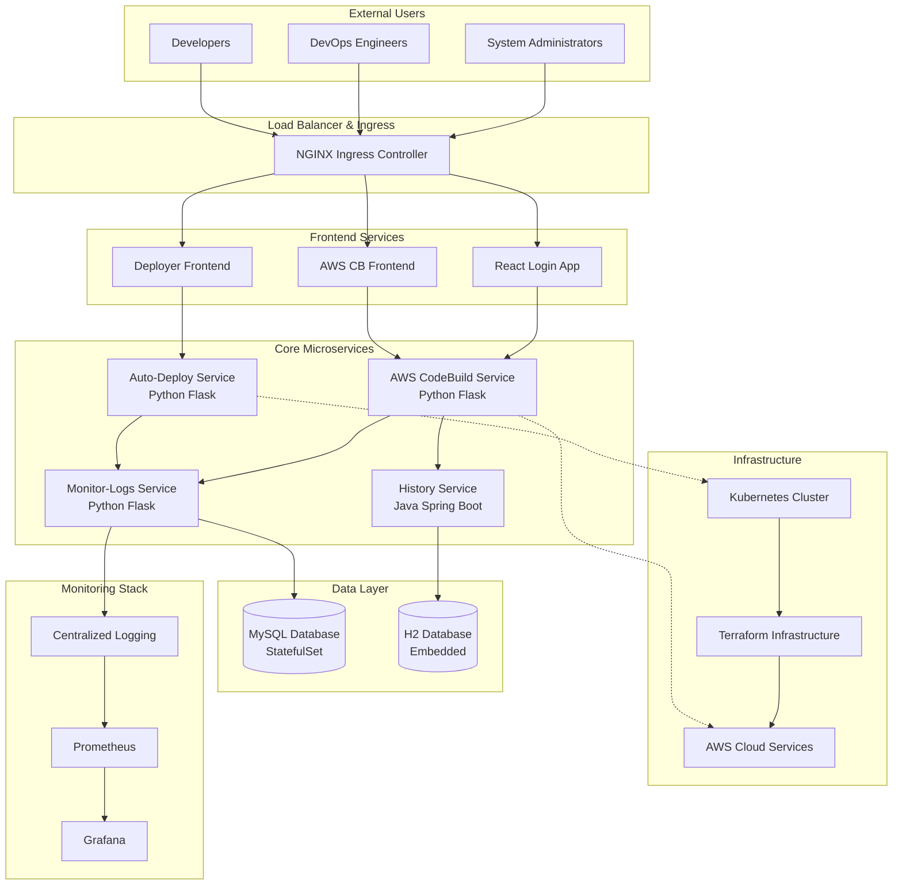
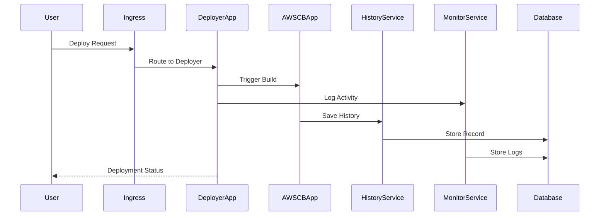

# AWS Deployer Microservices Platform

> **An enterprise-grade, cloud-native microservices platform that automates application deployment, provides real-time monitoring, and manages infrastructure at scale**

[](https://opensource.org/licenses/MIT)
[](https://www.docker.com/)
[](https://kubernetes.io/)
[](https://www.python.org/)
[](https://openjdk.java.net/)

## 📋 Table of Contents

- [🎯 Project Overview](#project-overview)
- [✨ Key Features](#key-features)
- [🏗️ System Architecture](#system-architecture)
- [🔧 Microservices Breakdown](#microservices-breakdown)
- [⚙️ DevOps & Infrastructure](#devops--infrastructure)
- [🚀 Getting Started](#getting-started)
- [📊 Monitoring & Observability](#monitoring--observability)
- [🔐 Security Features](#security-features)
- [📈 Scalability & Performance](#scalability--performance)
- [🛠️ Development Workflow](#development-workflow)
- [📚 API Documentation](#api-documentation)
- [🤝 Contributing](#contributing)
- [📄 License](#license)

---

## 🎯 Project Overview

The **AWS Deployer Microservices Platform** is a comprehensive, production-ready solution that simplifies application deployment and infrastructure management in cloud environments. This platform showcases modern DevOps practices and enterprise-level microservices architecture, making it an ideal reference implementation for teams looking to build scalable, maintainable systems.

**Perfect for:**
- DevOps teams implementing microservices architecture
- Organizations adopting cloud-native practices
- Developers learning modern deployment strategies
- Companies seeking automated infrastructure management
- Educational purposes and technical demonstrations

## ✨ Key Features

- **🚀 Automated Deployment**: Complete CI/CD pipeline with Docker and Kubernetes integration
- **📊 Real-time Monitoring**: Comprehensive logging and activity tracking across all services
- **🏗️ Infrastructure as Code**: Terraform-managed AWS infrastructure with one-click setup
- **🔒 Enterprise Security**: RBAC, network policies, and automated secrets management
- **📈 Auto-scaling**: Kubernetes HPA for intelligent resource management
- **🌐 Microservices Architecture**: Loosely coupled, independently deployable services
- **📱 Modern Web Interfaces**: React-based frontends with responsive design
- **🔄 Service Mesh**: Advanced inter-service communication and monitoring
- **📝 Audit Trails**: Complete historical tracking of all system activities
- **🌍 Cloud-Native**: Designed for AWS with multi-cloud compatibility

---

## 🏗️ System Architecture

### 🎨 High-Level Architecture

This platform implements a modern microservices architecture that follows industry best practices for cloud-native applications. Each component is designed to be independently scalable, maintainable, and secure.



### 📐 Component Interaction Flow

The following sequence diagram illustrates how different services interact within the platform:



---

## 🔧 Microservices Breakdown

The platform consists of five core microservices, each designed with a specific responsibility and built using industry-standard technologies. This section provides detailed insights into each service's architecture and functionality.

### 1. 🚀 Auto Deploy Microservice

**Purpose**: Provides automated Docker and Kubernetes deployment capabilities with enterprise-grade security and monitoring features.

**Technology Stack**:
- **Backend**: Python Flask application
- **Frontend**: Static web interface with modern UI/UX
- **Container**: Docker Hub integration for image management
- **Orchestration**: Direct Kubernetes API integration

**Core Capabilities**:
```python
# Secure Docker authentication and management
@deployer_bp.route("/docker-login", methods=["POST"])
def docker_login():
    # Implements secure Docker Hub authentication
    # Provides automated image building and pushing
    # Includes credential masking and comprehensive security logging
    pass

# Intelligent Kubernetes deployment automation
@deployer_bp.route("/deploy", methods=["POST"])  
def deploy_to_kubernetes():
    # Generates optimized YAML manifests
    # Executes automated kubectl operations
    # Provides real-time deployment status monitoring
    pass
```

**Infrastructure Configuration**:
- **Auto-scaling**: HPA configured for 1-10 replicas based on CPU/memory usage
- **Service Discovery**: ClusterIP service exposing port 5000
- **Security**: Dedicated RBAC with deployer service account
- **Network Isolation**: Custom network policies for controlled access

### 2. ☁️ AWS CodeBuild Microservice

**Purpose**: Integrates with AWS services to provide comprehensive CI/CD pipeline management and cloud operations automation.

**Technology Stack**:
- **Main Backend**: Python Flask with AWS SDK integration
- **Static Frontend**: Responsive HTML/CSS/JavaScript interface  
- **Authentication**: React-based secure login module
- **Cloud Integration**: Native AWS CodeBuild, ECR, and other AWS services

**Core Capabilities**:
```python
# AWS CodeBuild project management
@app.route("/create-codebuild-project", methods=["POST"])
def create_codebuild_project():
    # Dynamic CodeBuild project creation
    # GitHub integration for source code
    # Automated build triggers

# AWS CLI operations
@app.route("/aws-operation", methods=["POST"])
def aws_operation():
    # Dynamic AWS CLI command execution
    # Secure credential management
    # Real-time operation monitoring
```

**Service Communication**:
- **History Service**: `http://history-service:8081`
- **Monitor Service**: `http://flask-monitor:6000`
- **Deployer Service**: `http://deployer-app:5000`

### 3. 📚 HISTORY-SERVICE-MICROSERVICE

**Purpose**: Audit trail and historical data management using Spring Boot

**Key Components**:
- **Backend**: Spring Boot application
- **Database**: H2 embedded database
- **REST API**: Comprehensive history management endpoints

**Core Features**:
```java
@RestController
@RequestMapping("/history")
public class HistoryController {
    
    @PostMapping("/save")
    public ResponseEntity<String> saveHistory(@RequestBody HistoryRequest request) {
        // Persistent audit logging
        // Structured data storage
        // Automatic timestamping
    }
    
    @GetMapping("/list")
    public List<History> getHistory() {
        // Paginated history retrieval
        // Advanced filtering options
        // Performance-optimized queries
    }
}
```

**Entity Model**:
```java
@Entity
public class History {
    @Id
    @GeneratedValue(strategy = GenerationType.IDENTITY)
    private Long id;
    
    @Column(nullable = false)
    private String query;
    
    @Lob
    private String output;
    
    private LocalDateTime timestamp;
}
```

### 4. 📊 MONITOR-LOGS-MICROSERVICE

**Purpose**: Centralized logging, monitoring, and observability platform

**Key Components**:
- **Backend**: Flask application with SQLAlchemy ORM
- **Database**: MySQL with StatefulSet for persistence
- **Web Interface**: Real-time log viewing dashboard

**Core Features**:
```python
class UserAction(db.Model):
    __tablename__ = "user_actions"
    id = db.Column(db.Integer, primary_key=True)
    timestamp = db.Column(db.DateTime, default=datetime.utcnow)
    user_id = db.Column(db.String(128))
    service = db.Column(db.String(50))
    endpoint = db.Column(db.String(128))
    action_type = db.Column(db.String(128))
    request_data = db.Column(db.Text)
    response_summary = db.Column(db.Text)
    ip_address = db.Column(db.String(45))
    user_agent = db.Column(db.String(256))

@app.route("/monitor/log", methods=["POST"])
def log_action():
    # Structured logging with data masking
    # Real-time activity tracking
    # Secure sensitive data handling
```

**Monitoring Dashboard**:
- Real-time activity feed
- Service performance metrics
- User behavior analytics
- Security audit trails

### 5. 🏗️ INFRA-ONECLICK

**Purpose**: Infrastructure automation and one-click environment setup

**Key Components**:
- **Terraform**: AWS infrastructure provisioning
- **Setup Scripts**: Automated Kubernetes cluster configuration
- **K8s Manifests**: Core infrastructure components

**Infrastructure Components**:
```terraform
# EC2 instance for Kubernetes master
resource "aws_instance" "demo" {
  ami           = var.ami_id
  instance_type = var.instance_type
  key_name      = "ashwanthramnv"
  
  user_data = templatefile("${path.module}/setup.sh", {
    runner_token = var.runner_token
  })
  
  tags = {
    Name = "awsdeployer"
  }
}
```

**Automated Setup Features**:
```bash
#!/bin/bash
# Complete Kubernetes cluster setup
# Docker installation and configuration
# Weave network plugin deployment
# NGINX ingress controller setup
# Metrics server installation
# Prometheus and Grafana deployment
```

---

## ⚙️ DevOps & Infrastructure

### 🐳 Containerization Strategy

Each microservice follows Docker best practices:

```dockerfile
# Multi-stage builds for optimized images
FROM python:3.11-slim
WORKDIR /app
COPY requirements.txt .
RUN pip install --no-cache-dir -r requirements.txt
COPY . .
EXPOSE 5000
CMD ["python", "app.py"]
```

### ☸️ Kubernetes Architecture

**Deployment Pattern**:
```yaml
apiVersion: apps/v1
kind: Deployment
metadata:
  name: flask-app
  namespace: ashapp
spec:
  replicas: 1
  selector:
    matchLabels:
      app: flask-app
  template:
    spec:
      serviceAccountName: flask-sa
      containers:
      - name: flask-app
        image: ashwanth01/flask-app:latest
        ports:
        - containerPort: 5000
        livenessProbe:
          tcpSocket:
            port: 5000
          initialDelaySeconds: 15
        readinessProbe:
          tcpSocket:
            port: 5000
          initialDelaySeconds: 5
```

**Auto-scaling Configuration**:
```yaml
apiVersion: autoscaling/v2
kind: HorizontalPodAutoscaler
metadata:
  name: flask-app-hpa
spec:
  scaleTargetRef:
    apiVersion: apps/v1
    kind: Deployment
    name: flask-app
  minReplicas: 1
  maxReplicas: 10
  metrics:
  - type: Resource
    resource:
      name: cpu
      target:
        type: Utilization
        averageUtilization: 70
```

### 🔐 Security Implementation

**RBAC Configuration**:
```yaml
apiVersion: rbac.authorization.k8s.io/v1
kind: Role
metadata:
  namespace: ashapp
  name: flask-role
rules:
- apiGroups: [""]
  resources: ["pods", "services"]
  verbs: ["get", "list", "create", "update", "delete"]
```

**Network Policies**:
```yaml
apiVersion: networking.k8s.io/v1
kind: NetworkPolicy
metadata:
  name: flask-app-netpol
spec:
  podSelector:
    matchLabels:
      app: flask-app
  policyTypes:
  - Ingress
  - Egress
  ingress:
  - from:
    - podSelector:
        matchLabels:
          role: frontend
```

---

## 🚀 Getting Started

### Prerequisites

| Tool | Version | Purpose |
|------|---------|---------|
| Docker | 20.10+ | Containerization |
| Kubernetes | 1.24+ | Orchestration |
| kubectl | 1.24+ | K8s CLI |
| Terraform | 1.5+ | Infrastructure |
| Python | 3.9+ | Backend development |
| Java | 11+ | Spring Boot services |
| Node.js | 16+ | Frontend development |

### 🔧 Installation & Setup

#### 1. Infrastructure Provisioning

```bash
# Navigate to infrastructure directory
cd INFRA-ONECLICK/terraform

# Initialize Terraform
terraform init

# Plan infrastructure changes
terraform plan

# Apply infrastructure
terraform apply -auto-approve

# Setup Kubernetes cluster
cd ../
chmod +x setup.sh
./setup.sh
```

#### 2. Deploy Core Infrastructure

```bash
# Create namespace and core resources
kubectl apply -f INFRA-ONECLICK/k8s/

# Verify namespace creation
kubectl get namespace ashapp
```

#### 3. Deploy Microservices

**Monitor Service (Deploy First - Required by Others)**:
```bash
cd MONITOR-LOGS-MICROSERVICE/backend

# Build and push Docker image
docker build -t ashwanth01/flask-monitor:latest .
docker push ashwanth01/flask-monitor:latest

# Deploy to Kubernetes
kubectl apply -f k8s/
```

**History Service**:
```bash
cd HISTORY-SERVICE-MICROSERVICE/backend/history-services

# Build Java application
mvn clean package

# Build and push Docker image
docker build -t ashwanth01/history-service:latest .
docker push ashwanth01/history-service:latest

# Deploy to Kubernetes
kubectl apply -f ../../k8s/
```

**AWS CB Service**:
```bash
cd AWS-CB-MICROSERVICE/backend

# Build and push Docker image
docker build -t ashwanth01/flask-app:latest .
docker push ashwanth01/flask-app:latest

# Deploy to Kubernetes
kubectl apply -f k8s/
```

**Auto Deploy Service**:
```bash
cd AUTODEPLOY-MICROSERVICE/backend

# Build and push Docker image
docker build -f deployer-dockerfile -t ashwanth01/deployer-app:latest .
docker push ashwanth01/deployer-app:latest

# Deploy to Kubernetes
kubectl apply -f k8s/
```

#### 4. Verify Deployment

```bash
# Check all pods are running
kubectl get pods -n ashapp

# Check services
kubectl get services -n ashapp

# Check ingress
kubectl get ingress -n ashapp

# View application logs
kubectl logs -f deployment/flask-app -n ashapp
```

#### 5. Access Applications

```bash
# Port forward to access services locally
kubectl port-forward service/flask-app 8080:5000 -n ashapp
kubectl port-forward service/deployer-app 8081:5000 -n ashapp
kubectl port-forward service/flask-monitor 8082:6000 -n ashapp
kubectl port-forward service/history-service 8083:8081 -n ashapp

# Access applications
# Main App: http://localhost:8080
# Deployer: http://localhost:8081
# Monitor: http://localhost:8082/monitor
# History API: http://localhost:8083/history/list
```

### 🏃‍♂️ Quick Start Commands

```bash
# One-command deployment (after infrastructure setup)
./scripts/deploy-all.sh

# Check system health
./scripts/health-check.sh

# View all logs
./scripts/view-logs.sh

# Scale services
kubectl scale deployment flask-app --replicas=3 -n ashapp
```

---

## 📊 Monitoring & Observability

### Monitoring Stack

The platform includes comprehensive monitoring with:

- **Application Logs**: Centralized via Monitor Service
- **Infrastructure Metrics**: Prometheus + Grafana
- **Health Checks**: Kubernetes probes
- **Distributed Tracing**: Service communication tracking

### Key Metrics Monitored

| Metric Type | Description | Tool |
|-------------|-------------|------|
| Application Performance | Response times, error rates | Custom logging |
| Infrastructure Health | CPU, Memory, Network | Prometheus |
| Service Dependencies | Inter-service communication | Monitor Service |
| Security Events | Authentication, authorization | Audit logs |
| Business Metrics | Deployment success rates | Custom dashboards |

### Accessing Monitoring

```bash
# View real-time activity logs
curl http://localhost:8082/monitor

# Check service health
kubectl get pods -n ashapp -o wide

# View resource usage
kubectl top pods -n ashapp
```

---

## 🔐 Security Features

### Authentication & Authorization

- **RBAC**: Kubernetes role-based access control
- **Service Accounts**: Dedicated accounts per service
- **Network Policies**: Traffic segmentation
- **Secrets Management**: Kubernetes secrets for sensitive data

### Data Protection

- **Credential Masking**: Automatic masking in logs
- **Encrypted Communication**: TLS between services
- **Input Validation**: Comprehensive request validation
- **Audit Logging**: Complete activity tracking

### Security Configuration

```yaml
# Example RBAC configuration
apiVersion: rbac.authorization.k8s.io/v1
kind: ClusterRole
metadata:
  name: deployment-manager
rules:
- apiGroups: ["apps"]
  resources: ["deployments"]
  verbs: ["get", "list", "create", "update", "patch", "delete"]
```

---

## 📈 Scalability & Performance

### Auto-scaling Strategy

- **Horizontal Pod Autoscaling**: Based on CPU/memory metrics
- **Vertical Pod Autoscaling**: Automatic resource adjustment
- **Cluster Autoscaling**: Node scaling based on demand

### Performance Optimizations

- **Container Resource Limits**: Proper resource allocation
- **Database Connection Pooling**: Efficient database usage
- **Caching Strategies**: Redis for session management
- **Load Balancing**: NGINX ingress with intelligent routing

### Scaling Commands

```bash
# Manual scaling
kubectl scale deployment flask-app --replicas=5 -n ashapp

# Update HPA configuration
kubectl patch hpa flask-app-hpa -p '{"spec":{"maxReplicas":20}}' -n ashapp

# View scaling events
kubectl describe hpa flask-app-hpa -n ashapp
```

---

## 🛠️ Development Workflow

### Local Development

1. **Environment Setup**:
```bash
# Create virtual environment
python -m venv venv
source venv/bin/activate

# Install dependencies
pip install -r requirements.txt
```

2. **Local Testing**:
```bash
# Run unit tests
python -m pytest tests/

# Run integration tests
./scripts/integration-tests.sh

# Local development server
flask run --debug
```

3. **Docker Development**:
```bash
# Build local image
docker build -t local/service:dev .

# Run with docker-compose
docker-compose up -d
```

### CI/CD Pipeline

The platform supports automated CI/CD with:

- **Build Stage**: Docker image creation
- **Test Stage**: Unit and integration tests
- **Security Scan**: Container vulnerability scanning
- **Deploy Stage**: Automated Kubernetes deployment
- **Smoke Tests**: Post-deployment validation

### Git Workflow

```bash
# Feature development
git checkout -b feature/new-functionality
git commit -m "feat: add new deployment feature"
git push origin feature/new-functionality

# Create pull request for review
# Automated CI/CD pipeline triggers
# Deploy to staging environment
# Production deployment after approval
```

---

## 📚 API Documentation

### Auto Deploy Service API

#### Docker Operations
```http
POST /deployer-api/docker-login
Content-Type: application/json

{
  "docker_user": "username",
  "docker_token": "access_token"
}
```

#### Kubernetes Deployment
```http
POST /deployer-api/deploy
Content-Type: application/json

{
  "repo_url": "https://github.com/user/repo.git",
  "image_name": "myapp",
  "tag": "latest",
  "namespace": "production"
}
```

### AWS CB Service API

#### CodeBuild Project Management
```http
POST /create-codebuild-project
Content-Type: application/json

{
  "project_name": "my-project",
  "source_location": "https://github.com/user/repo.git",
  "build_spec": "buildspec.yml"
}
```

#### AWS Operations
```http
POST /aws-operation
Content-Type: application/json

{
  "operation": "list-instances",
  "region": "us-east-1",
  "access_key": "AKIA...",
  "secret_key": "secret"
}
```

### History Service API

#### Save History
```http
POST /history/save
Content-Type: application/json

{
  "query": "deploy app to production",
  "output": "Deployment successful"
}
```

#### Get History
```http
GET /history/list
```

### Monitor Service API

#### Log Activity
```http
POST /monitor/log
Content-Type: application/json

{
  "user_id": "user123",
  "service": "deployer",
  "endpoint": "/deploy",
  "action_type": "deployment",
  "request_data": {"app": "myapp"},
  "response_summary": {"status": "success"}
}
```

#### View Logs
```http
GET /monitor
```

---

## 🔧 Troubleshooting

### Common Issues

#### Pod Startup Issues
```bash
# Check pod status
kubectl get pods -n ashapp

# View pod logs
kubectl logs <pod-name> -n ashapp

# Describe pod for events
kubectl describe pod <pod-name> -n ashapp
```

#### Service Communication Issues
```bash
# Test service connectivity
kubectl exec -it <pod-name> -n ashapp -- curl http://service-name:port

# Check service endpoints
kubectl get endpoints -n ashapp

# Verify network policies
kubectl get networkpolicies -n ashapp
```

#### Database Connection Issues
```bash
# Check MySQL StatefulSet
kubectl get statefulset -n ashapp

# View PVC status
kubectl get pvc -n ashapp

# Test database connectivity
kubectl exec -it mysql-0 -n ashapp -- mysql -u root -p
```

### Health Checks

```bash
# Service health endpoints
curl http://localhost:8080/health
curl http://localhost:8081/health
curl http://localhost:8082/health

# Kubernetes health checks
kubectl get pods -n ashapp --field-selector=status.phase=Running
```

---

## 🤝 Contributing

### Development Standards

- **Code Style**: Follow PEP 8 for Python, Google Java Style for Java
- **Testing**: Minimum 80% code coverage
- **Documentation**: Comprehensive API documentation
- **Security**: Security scanning for all commits
- **Performance**: Load testing for critical paths

### Contribution Workflow

1. Fork the repository
2. Create feature branch
3. Implement changes with tests
4. Submit pull request
5. Code review and approval
6. Automated deployment

---

## 📄 License

This project is licensed under the MIT License - see the [LICENSE](LICENSE) file for details.

---

## 👥 Support & Community

- **Issues**: GitHub Issues for bug reports
- **Discussions**: GitHub Discussions for questions
- **Documentation**: Wiki for detailed guides
- **Slack**: Community Slack channel

---

**Built with ❤️ by the DevOps Engineering Team**

ashwanth01-pixel: everything give me like i have to explain it to other like that and give me and go through my ccode and make it more explain in devops perspective it is more important give me now full from top to bottom

GitHub Copilot: Here’s a comprehensive, beginner-friendly explanation of your microservices system, structured so you can present it to others. This version is tailored to highlight DevOps practices, with references to your actual code and structure.

---

# Microservices System: Full Explanation (with DevOps Focus)

## 1. High-Level Overview

This project is a **microservices-based system** designed for cloud-native deployment, automation, monitoring, and infrastructure management. Each microservice is developed, built, and deployed independently, following best DevOps and cloud-native practices.

**Key Points:**
- Each microservice is in its own repository (in production), but here they are in one workspace for reference.
- All services are containerized (Docker) and orchestrated using Kubernetes.
- Infrastructure, deployment, scaling, and security are managed as code.

---

## 2. Microservices Breakdown

### 2.1 AUTODEPLOY-MICROSERVICE

- **Purpose:** Automates deployment of applications (likely to AWS/Kubernetes).
- **Backend:** Python (`backend/deployer/app.py`), dependencies in `requirements.txt`.
- **Frontend:** Static web files (`deployer_frontend/`).
- **Kubernetes:** Manifests for deployment, scaling (HPA), network policies, RBAC, and services.
- **DevOps:** Dockerfile for backend, manifests for infra as code, version tracking with `GIT_SHA.txt`.

### 2.2 AWS-CB-MICROSERVICE

- **Purpose:** Handles AWS CodeBuild or similar CI/CD tasks.
- **Backend:** Python (`backend/app.py`).
- **Frontend:** Static files and a React login app (`frontend/`, `login/`).
- **Kubernetes:** Manifests for deployment, scaling, network, RBAC, and services.
- **DevOps:** Dockerfile, manifests, version tracking.

### 2.3 HISTORY-SERVICE-MICROSERVICE

- **Purpose:** Manages historical data (logs, audit).
- **Backend:** Java (Spring Boot, see `history-services/`).
- **Database:** Embedded DB (`data/`).
- **Kubernetes:** Manifests for deployment, scaling, RBAC, and services.
- **DevOps:** Dockerfile, manifests, version tracking.

### 2.4 INFRA-ONECLICK

- **Purpose:** Automates infrastructure provisioning (namespace, ingress, persistent volumes).
- **Scripts:** Shell script (`script.sh`).
- **Kubernetes:** Manifests for namespace, ingress, PV.
- **DevOps:** All infra as code, one-click setup.

### 2.5 MONITOR-LOGS-MICROSERVICE

- **Purpose:** Centralized log monitoring and aggregation.
- **Backend:** Python (`database/app.py`).
- **Database:** Models and requirements in `database/`.
- **Kubernetes:** Manifests for deployment, scaling, network, RBAC, secrets, services, statefulset.
- **DevOps:** Dockerfile, manifests, version tracking.

---

## 3. How the System Works (End-to-End)

1. **Development:**  
   Each microservice is developed independently, with its own codebase, dependencies, and documentation.

2. **Containerization:**  
   Each service has a Dockerfile. The code is packaged into a Docker image, ensuring consistency across environments.

3. **Infrastructure as Code:**  
   All Kubernetes resources (deployments, services, HPA, RBAC, network policies, secrets) are defined as YAML manifests. This makes the infrastructure reproducible and version-controlled.

4. **CI/CD Pipelines:**  
   (Implied by naming and structure) Each repo can have its own pipeline (e.g., GitHub Actions, AWS CodeBuild) to automate:
   - Linting and testing
   - Building Docker images
   - Pushing images to a registry
   - Deploying to Kubernetes

5. **Deployment:**  
   - Use `kubectl apply -f k8s/` to deploy each service.
   - HPA ensures services scale based on demand.
   - Network policies and RBAC enforce security.

6. **Monitoring & Logging:**  
   - MONITOR-LOGS-MICROSERVICE aggregates logs.
   - StatefulSets and persistent volumes ensure log data is durable.

7. **Access & Frontend:**  
   - Some services expose web UIs (static or React).
   - Ingress and services manage external/internal access.

---

## 4. DevOps Best Practices in This Project

### 4.1 Microservice Isolation

- Each service is self-contained, with its own code, dependencies, and deployment pipeline.
- Enables independent scaling, deployment, and updates.

### 4.2 Containerization

- Dockerfiles for each backend ensure consistent environments.
- Images can be built and run anywhere (local, cloud, CI/CD).

### 4.3 Infrastructure as Code

- All Kubernetes resources are defined as YAML files.
- Enables version control, code review, and reproducibility.

### 4.4 Automated Deployment & Scaling

- Use of HPA for auto-scaling based on resource usage.
- CI/CD pipelines automate build, test, and deploy steps.

### 4.5 Security

- RBAC restricts access to Kubernetes resources.
- Network policies limit pod-to-pod communication.
- Secrets are managed via Kubernetes secrets.

### 4.6 Monitoring & Logging

- Centralized log aggregation for observability.
- Use of persistent storage for logs.

### 4.7 Versioning & Traceability

- `GIT_SHA.txt` tracks the exact code version deployed.
- Each deployment is traceable to a specific commit.

### 4.8 Documentation & Onboarding

- Each service has a README.
- Clear folder structure and naming conventions.

---

## 5. Tools & Technologies Used

- **Languages:** Python, Java, JavaScript (React)
- **Frameworks:** Flask, Spring Boot, React
- **Containerization:** Docker
- **Orchestration:** Kubernetes
- **CI/CD:** AWS CodeBuild, GitHub Actions (implied)
- **Database:** Embedded DB (Java), SQLite or similar (Python)
- **Frontend:** Static HTML/CSS/JS, React
- **Automation:** Shell scripts
- **Version Control:** Git

---

## 6. How to Get Started (Step-by-Step)

1. **Clone the Repositories:**  
   Each microservice is in its own repo. Clone the ones you need.

2. **Install Prerequisites:**  
   - Docker, kubectl, minikube (or access to a Kubernetes cluster)
   - Python 3.x, pip
   - JDK, Maven (for Java)
   - Node.js, npm (for React)

3. **Install Dependencies:**  
   - Python: `pip install -r requirements.txt`
   - Java: `mvn clean install`
   - React: `npm install` in the `login/` directory

4. **Build Docker Images:**  
   - `docker build -t <service-name>:latest .` in each backend directory

5. **Deploy to Kubernetes:**  
   - `kubectl apply -f k8s/` in each service

6. **Access Services:**  
   - Use `kubectl port-forward` or set up ingress as per INFRA-ONECLICK

---

## 7. Explaining to Others: Key Talking Points

- **Why Microservices?**  
  Scalability, independent deployment, fault isolation, technology diversity.

- **Why DevOps?**  
  Automation, faster delivery, reliability, repeatability, and security.

- **How is DevOps Achieved Here?**  
  - Everything is code: app, infra, deployment.
  - Automated pipelines for build/test/deploy.
  - Security and monitoring are built-in.
  - Documentation and versioning for traceability.

- **How to Extend or Add a New Service?**  
  - Scaffold a new repo with the same structure.
  - Add Dockerfile, manifests, and CI/CD pipeline.
  - Register with ingress and monitoring.

---

## 8. DevOps-Focused Summary

This system is a textbook example of modern DevOps and microservices:
- **Everything is automated and reproducible.**
- **Security, scaling, and monitoring are first-class citizens.**
- **Each service is independently manageable, deployable, and observable.**
- **Infrastructure is managed as code, enabling rapid, reliable changes.**

---

If you need a sample script, manifest, or want to see a specific DevOps pipeline example, let me know!
